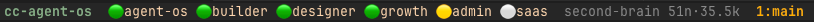
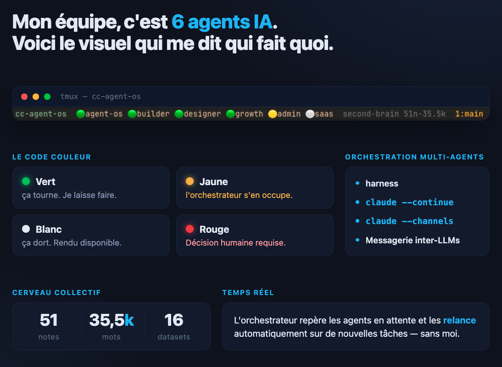

# 🚦 tmux-agents-statusline

**La status bar qui te dit qui fait quoi** — superviser plusieurs agents IA (Claude Code, aider, …) d'un coup d'œil, sans changer de fenêtre :



```
cc-agent-os  🟢agent-os 🟢builder 🟢designer 🟢growth 🟡admin ⚪saas
```

## Le code couleur

| Pastille | État | Ce que tu fais |
|---|---|---|
| 🟢 | ça tourne | tu laisses faire |
| 🟡 | a livré, attend l'orchestrateur | rien — un autre agent prend le relais |
| ⚪ | ça dort, rendu disponible | rien |
| 🔴 | décision humaine requise | **tu reviens — uniquement là** |

Le principe : **tu ne reviens que sur le rouge.** Tout le reste vit sans toi.

## Installation (5 min)

```bash
mkdir -p ~/.config/tmux
cp pastilles.sh statusline.conf ~/.config/tmux/
chmod +x ~/.config/tmux/pastilles.sh
echo 'source-file ~/.config/tmux/statusline.conf' >> ~/.tmux.conf
tmux source-file ~/.tmux.conf
```

Adapte la liste d'agents dans `statusline.conf` (variable `PASTILLE_AGENTS`).

## Alimenter les pastilles

Le script est un simple registre à fichiers — n'importe quel process peut poser un état :

```bash
# L'agent "builder" travaille (à poser par un watcher qui surveille son transcript)
pastilles.sh active builder 1

# "admin" a livré et attend une validation de l'orchestrateur
pastilles.sh rest admin waiting

# "saas" est bloqué sur une décision humaine
pastilles.sh rest saas blocked

# Un menu de permission est affiché chez "builder" → rouge prioritaire
pastilles.sh prompt builder 1
```

Les signaux `active` et `prompt` expirent automatiquement (30 s par défaut, `PASTILLE_STALE`) : si le watcher meurt, la pastille se dégrade proprement au lieu de mentir.

**Idée de watcher minimal** : un cron/daemon qui pose `active <agent> 1` quand le fichier de transcript de l'agent a été modifié dans les 10 dernières secondes.

## Ça vient d'où ?



Extrait de mon setup de production : une équipe d'agents Claude Code qui tourne en continu sur mon Mac. Pour en discuter : [Yannick Goalen sur LinkedIn](https://www.linkedin.com/in/y-goalen/).

Licence MIT — si tu réutilises, un lien vers le repo fait toujours plaisir.
